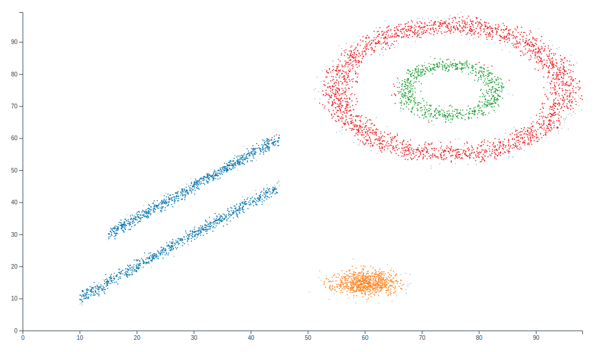
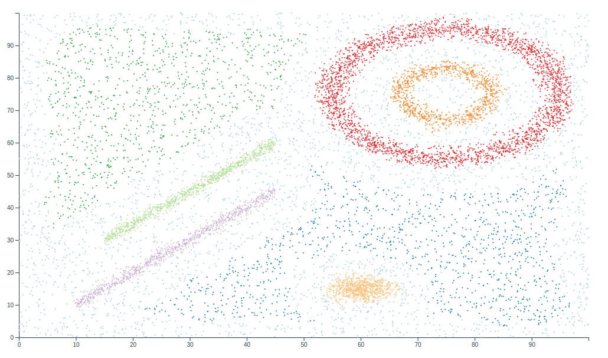
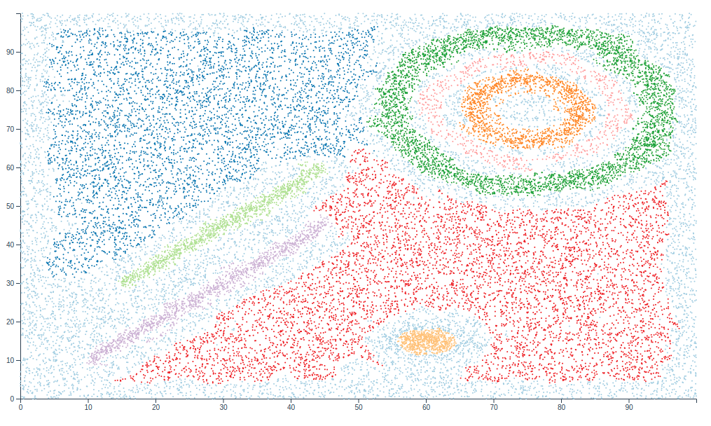
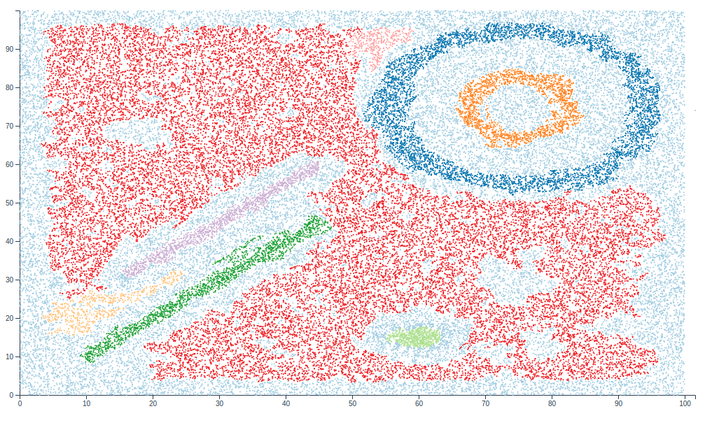

# Cluster-Wasser

This is a python library created to perform a Wasserstein-Distance based clustering algorithm.

## How do you use it?

Currently, two functions are offered for clustering based on the Wasserstein-Distance.

Create clusters for a given `wasser_margin`.

```python 
def wasser(features, wasser_margin, labels=[], neighs=200, edges=[])
```

Create clusters for a given range of `wasser_margin`. The range is defined by a start, an end and the step size for each
increment of the `wasser_margin`.

```python 
def wasser_range(features, range_from, range_until, range_step, labels=[], neighs=200, edges=[])
```

Import them like so

```python 
from cluswasser.cluster import wasser, wasser_range
```

### Description of the input parameters

- `features` ndarray with dimensions [n_samples, n_features]
- `wasser_margin` a value between 0 and 1, representing a Wasserstein-Distance between min and max of all calculated
  Wasserstein-Distances in percent. This value will tell the algorithm when to stop clustering.
- `labels` ndarray with one dimension, representing the actual label. It is optional and can be provided to compare the
  actual clustering with the new label assigned by the algorithm.
- `neighs` amount of neighbours that should be used for calculating the Wasserstein-Distance of an Edge.
- `edges` an optional value, that can be provided to increase performance. For a given plot, edges could be stored and
  later reused. To increase performance, instead of recalculating the edges, you could pass them directly.
- `range_from` start of the wasser_margin range
- `range_until` end of the wasser_margin range
- `range_step` The step size will indicate the increase to the last wasser_margin.

## How does it work?

The algorithm performs a set of steps, described below:

- Create Delaunay tree from vertices
- Select k neighbours with k-nearest neighbour “ball-tree” algorithm
- Calculate wasserstein distance for each Edge in the Delaunay tree, with provided neighbour dists
- Sort edges by Wasserstein distance
- Apply union find algorithm until Wasserstein margin
- Resulting disjoint trees are sorted by size and significant clusters are selected
- Remaining clusters and points are merged into a noise cluster

After the algorithm has finished, it will provide you with following result:

```python
class WasserIncrement:
    def __init__(self, wasser_margin, clus_data, runtime, overall_time):
        self.wasser_margin = float(wasser_margin)
        self.clusters = clus_data.clusters
        self.max_features = clus_data.max_features
        self.runtime = float(runtime)
        self.overall_time = float(overall_time)
```

If you use the `wasser_range` function, you will be given a list of WasserIncrements, each representing a `range_step`
between the given parameters `range_from` and `range_until`.

## Clustering results
I have tested this algorithm against different files and different probability distributions. But I focused on the
data provided by AdaWaveClustering (https://github.com/JHL-HUST/AdaWaveClustering/tree/master/AdaWave). The algorithm was
tested against all files contained within https://github.com/JHL-HUST/AdaWaveClustering/tree/master/AdaWave/syntheticData
and especially in high noise environments I got good results, in terms of NMI.


NMI: 0.8599988147219229


NMI: 0.8937265223637488


NMI: 0.7933637906627017


NMI: 0.7236599764107432

## Example Implementation

An example implementation can be seen in following project: https://github.com/barblin/clusterization-service. In this
project, the Wasserstein based algorithm is added as library and is used to produce clusters.

An example for visualizing these clusters can be seen in following project: https://github.com/barblin/clusterization-ui
. The clusterization-ui is also able to plot many other views related to the clustering algorithm. So check it out, if
you want to see more.

If you want a quickstart, you can follow this link: https://github.com/barblin/clusterizer-setup-debian-ubuntu. This
will provide you with a fast and easy development environment setup.

